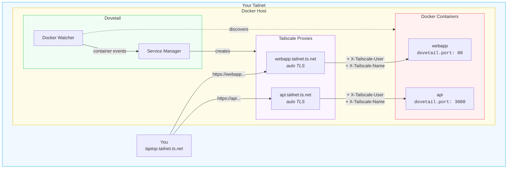

# Dovetail 🕊️

Dovetail is a lightweight reverse proxy that automatically exposes Docker containers to your Tailscale tailnet over HTTPS. Simply add labels to your containers and they become accessible as secure endpoints on your private network.

## How It Works



**The Flow:**
1. Label your containers with `dovetail.name` and `dovetail.port`
2. Dovetail watches Docker and auto-discovers labeled containers
3. Each container gets its own Tailscale node with automatic TLS certificates
4. Requests are proxied with identity headers (`X-Tailscale-User`, `X-Tailscale-Name`, etc.)

## Key Features

- **Automatic Discovery**: Monitors Docker for container events and exposes labeled services
- **Zero Configuration TLS**: Tailscale handles certificate provisioning automatically
- **Identity Headers**: Injects Tailscale user info (`X-Tailscale-User`, `X-Tailscale-Name`, etc.) into proxied requests
- **Persistent Identity**: Services maintain their Tailscale identity across restarts

## Installation

```bash
docker pull ghcr.io/wu-json/dovetail:latest
```

## Usage

Add labels to containers you want to expose:

```yaml
services:
  webapp:
    image: nginx:latest
    labels:
      dovetail.name: "webapp"
      dovetail.port: "80"
```

Run dovetail alongside your containers:

```yaml
services:
  dovetail:
    image: ghcr.io/wu-json/dovetail:latest
    environment:
      - TS_AUTHKEY=${TS_AUTHKEY}
    volumes:
      - /var/run/docker.sock:/var/run/docker.sock:ro
      - dovetail-state:/var/lib/dovetail
    restart: unless-stopped
```

Your service will be available at `https://webapp.<tailnet-name>.ts.net`.

## Configuration

### Environment Variables

| Variable | Description | Default |
|----------|-------------|---------|
| `TS_AUTHKEY` | Tailscale auth key (required, must be reusable) | - |
| `TS_STATE_DIR` | Directory for persisting Tailscale state | `/var/lib/dovetail` |

### Docker Labels

| Label | Required | Description |
|-------|----------|-------------|
| `dovetail.name` | Yes | Hostname for the service on your tailnet |
| `dovetail.port` | Yes | Container port to proxy |

